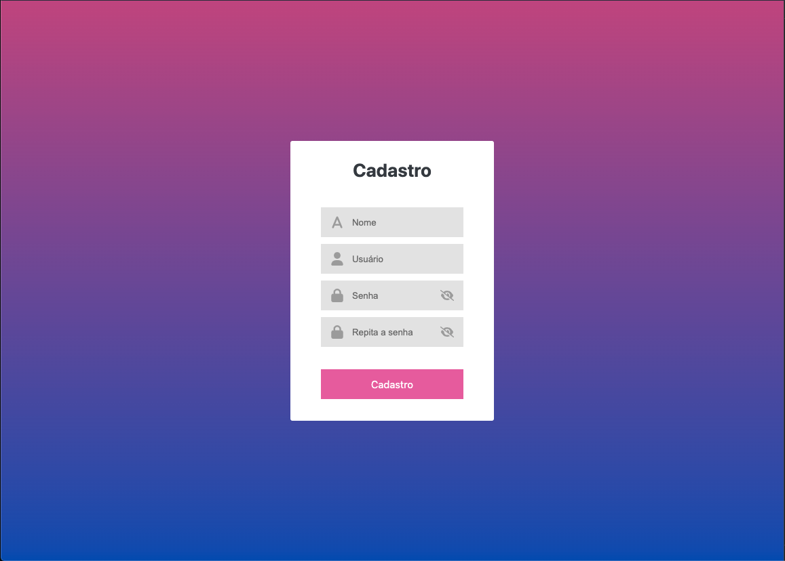
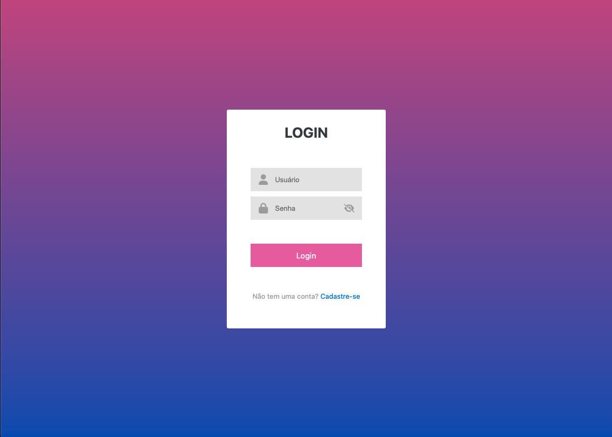
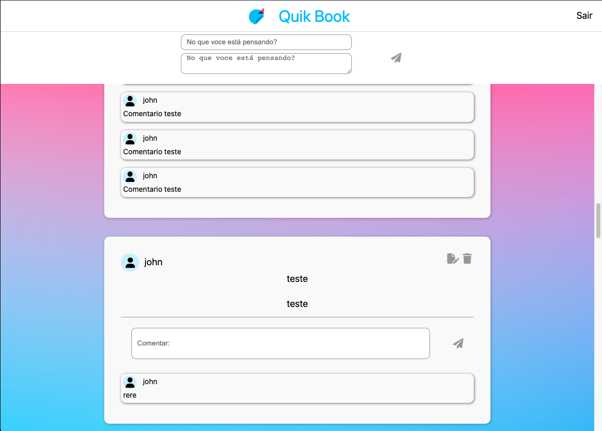

# QuikBook

Sitema feito com Next.JS, TypeScript, Material UI, FontAwesome Icons

Três telais feitas de acordo com o que foi pedido para o teste técnico, usando a FakeAPi proposta.

O sistema está dividido em três partes:

## Cadastro

Onde você informa seus dados tais como: Nome, Usuário, Senha e Confirmação da Senha.

Terá algumas validações: Não pode nenhum campo estar vazio, mínimo de caracteres é 4 para cada campo e o máximo é 20, e as senhas devem ser iguais

Tem a funcionalidade de ver o texto inserido nas senhas ou não.

Assim que for feito o cadastro do usuário irá aparecer um Toast confirmando e você será redirecionado automaticamente para tela de login

## Login

Onde você informa seus dados tais como: Usuário e Senha.

Se caso seus dados forem incorretos será renderizado um Toast com tal erro vindo da API.

O campo de senha tem a opção de ver ou não o texto digitado.

Link embaixo para fazer cadastro.

O login sendo feito com sucesso, você será jogado para tela de HOME, caso tente navegar para ela diretamente pela url e não tenha o usuário autorizado você será redirecionado para tela de login

## Home

Onde se encontra a principal parte do sistema, um menu no estilo NavBar com a logo e a opção de fazer logout do sistema.

Logo abaixo a parte de fazer um novo post onde você insere título e o conteúdo do post feito isso, ele ira carregar a página com o seus post no fim dela.

### Posts

Neles contem a opção de atualizar ou deletar o post, quando irá deletar ele pede uma confirmação com um Alert.

Na parte inferior tem os comentários onde você pode inserir um novo comentário no input.

